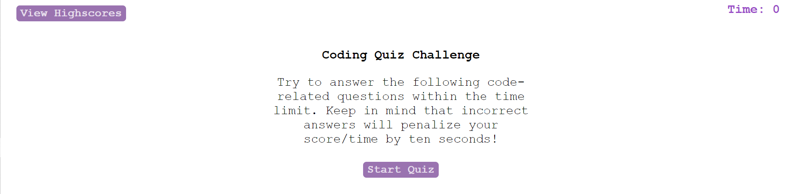

# code-quiz

## Description
This is a simple website application written in Javascript, CSS, and HTML designed to give a brief quiz on some basic webdev concepts. It is a timed quiz, with wrong answers subracting from the allotted time. The final score is determined by the remaining time, and the site features a highscore page that can be cleared by the user. 

## Usage
Provided is a screenshot of the website application.
    

    

## License
 This program is free software: you can redistribute it and/or modify
    it under the terms of the GNU General Public License as published by
    the Free Software Foundation, either version 3 of the License, or
    (at your option) any later version.

    This program is distributed in the hope that it will be useful,
    but WITHOUT ANY WARRANTY; without even the implied warranty of
    MERCHANTABILITY or FITNESS FOR A PARTICULAR PURPOSE.  See the
    GNU General Public License for more details.

    You should have received a copy of the GNU General Public License
    along with this program.  If not, see <https://www.gnu.org/licenses/>.

## Deployed Site
The page can be reached at https://hibiadelei.github.io/code-quiz/